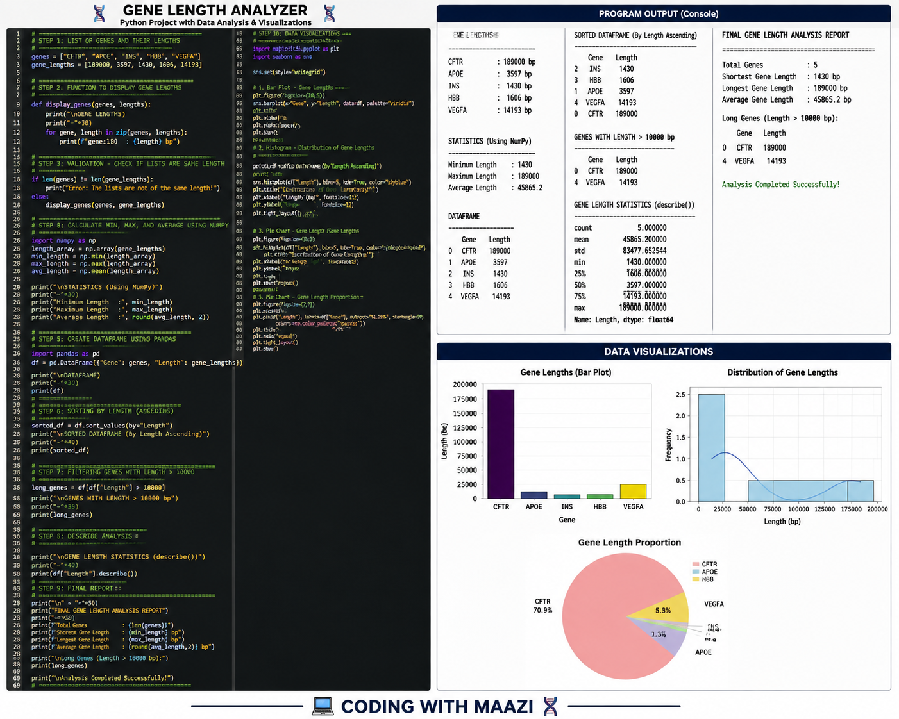

# 🧬 Gene Length Analyzer

### Python-Based Computational Biology & Gene Data Analysis Project

> 🔬 **Analyze • Calculate • Sort • Filter • Visualize • Report**

Gene Length Analyzer is a Python-based **Computational Biology** project designed to analyze gene-length data using Python programming, NumPy, Pandas, Matplotlib, and Seaborn.

The project demonstrates how biological data can be transformed into meaningful statistical information through **data processing, numerical analysis, DataFrames, sorting, filtering, statistical summaries, and visualization**.

---

## 📌 Project Overview

Gene length is an important characteristic of genomic data. In this project, a collection of genes and their corresponding lengths are analyzed programmatically.

The analyzer performs several operations, including:

* 🧬 Gene data organization
* 🔄 Function-based processing
* ✅ Conditional analysis
* 🔢 Numerical calculations
* 📊 DataFrame creation
* ↕️ Data sorting
* 🔍 Data filtering
* 📈 Statistical analysis
* 📊 Data visualization
* 📋 Final analysis report

This project provides practical experience with handling biological datasets using Python.

---

## 🎯 Project Objectives

The main objectives of this project are:

1. To store gene names and their lengths using Python lists.
2. To process gene data using functions and loops.
3. To classify genes according to their lengths.
4. To calculate minimum, maximum, and average gene lengths.
5. To organize biological data using Pandas DataFrames.
6. To sort genes according to their length.
7. To filter genes based on a selected length threshold.
8. To generate statistical summaries using `describe()`.
9. To visualize gene-length patterns.
10. To generate a final gene-length analysis report.

---

## 🧬 Biological Data Used

The project currently analyzes the following example genes:

| Gene  | Length |
| ----- | -----: |
| CFTR  | 189000 |
| APOE  |   3597 |
| INS   |   1430 |
| HBB   |   1606 |
| VEGFA |  14193 |

> **Note:** The dataset is used for programming and computational biology practice and is not intended as a clinical or diagnostic dataset.

---

## 🛠️ Technologies Used

### 🐍 Python

Used as the main programming language for biological data processing and analysis.

### 🔢 NumPy

Used for numerical calculations such as:

* Minimum
* Maximum
* Mean
* Array conversion

### 🐼 Pandas

Used for:

* DataFrame creation
* Sorting
* Filtering
* Statistical summaries

### 📊 Matplotlib

Used for creating data visualizations and charts.

### 🎨 Seaborn

Used to create cleaner and more informative statistical visualizations.

---

## 🔍 Core Python Concepts

This project covers several important Python concepts:

* Lists
* Variables
* Functions
* `for` loops
* `if / elif / else`
* `zip()`
* NumPy arrays
* Pandas DataFrames
* Sorting
* Filtering
* Statistical methods
* Data visualization

---

## 📊 Data Analysis Workflow

The project follows this workflow:

```text
Gene Data
    ↓
Python Lists
    ↓
Functions & Loops
    ↓
Conditional Classification
    ↓
NumPy Analysis
    ↓
Pandas DataFrame
    ↓
Sorting
    ↓
Filtering
    ↓
describe()
    ↓
Data Visualization
    ↓
Final Analysis Report
```

---

## 🔢 Numerical Analysis

NumPy is used to calculate important gene-length statistics.

### Minimum Length

Identifies the shortest gene in the dataset.

### Maximum Length

Identifies the longest gene in the dataset.

### Mean Length

Calculates the average length of all genes.

Example:

```python
np.min(length_array)
np.max(length_array)
np.mean(length_array)
```

---

## 📊 Pandas DataFrame

The gene information is converted into a structured Pandas DataFrame.

```python
df = pd.DataFrame({
    "Gene": genes,
    "Length": gene_lengths
})
```

This makes the biological data easier to analyze, sort, filter, and summarize.

---

## ↕️ Sorting Analysis

The project sorts genes according to their length using:

```python
df.sort_values(by="Length")
```

This allows the shortest and longest genes to be easily compared.

---

## 🔍 Filtering Analysis

Genes can also be filtered according to a specific length condition.

For example:

```python
long_genes = df[df["Length"] > 10000]
```

This identifies genes with a length greater than **10,000 bp**.

---

## 📈 Statistical Summary

The project uses Pandas `describe()` to generate a statistical overview of the gene-length data.

```python
df["Length"].describe()
```

This provides values such as:

* Count
* Mean
* Standard deviation
* Minimum
* 25th percentile
* Median
* 75th percentile
* Maximum

---

# 📊 Data Visualization

Visualization makes it easier to understand differences between gene lengths and identify patterns in the dataset.

### 📌 Visualizations Included

* 📊 **Gene Length Bar Plot**
* 📈 **Distribution of Gene Lengths**
* 🥧 **Gene Length Proportion**

These visualizations are generated using **Matplotlib and Seaborn**.

---

## 🖼️ Project Visualization



> The visualization image contains the project workflow, code, program output, DataFrame analysis, statistical results, and graphical representations.

---

## 📋 Final Analysis Report

The final report provides a concise summary of the analysis, including:

```text
Total Genes
Shortest Gene Length
Longest Gene Length
Average Gene Length
Long Genes
Statistical Summary
```

This combines the numerical and DataFrame analysis into one final result.

---

## 📁 Project Structure

```text
Gene-Length-Analyzer/
│
├── gene_length_analyzer.py
├── gene_length_analyzer.png
├── requirements.txt
└── README.md
```

### 📄 `gene_length_analyzer.py`

Main Python source code containing the complete analysis and visualization workflow.

### 🖼️ `gene_length_analyzer.png`

Project preview showing the code, outputs, analysis, and visualizations.

### 📦 `requirements.txt`

Contains the Python libraries required to run the project.

### 📖 `README.md`

Project documentation and explanation.

---

## ⚙️ Installation

Clone the repository:

```bash
git clone YOUR_REPOSITORY_URL
```

Move into the project directory:

```bash
cd Gene-Length-Analyzer
```

Install the required libraries:

```bash
pip install -r requirements.txt
```

---

## ▶️ How to Run

Run the Python program using:

```bash
python gene_length_analyzer.py
```

The program will perform the complete analysis and generate the visualizations.

---

## 📦 Requirements

The project requires:

```text
numpy
pandas
matplotlib
seaborn
```

---

## 🎓 Learning Outcomes

By completing this project, the following skills are practiced:

### Python Programming 🐍

* Lists
* Functions
* Loops
* Conditions
* Data processing

### Data Analysis 📊

* NumPy calculations
* Pandas DataFrames
* Sorting
* Filtering
* Statistical summaries

### Computational Biology 🧬

* Working with biological gene data
* Quantitative analysis of genomic features
* Interpreting biological datasets computationally

### Data Visualization 📈

* Bar plots
* Distribution plots
* Proportion visualization
* Biological data interpretation

---

## 🚀 Future Improvements

This project can be extended by adding:

* 📂 FASTA file input
* 🧬 Real genomic datasets
* 🔬 Gene sequence analysis
* 📊 Interactive dashboards
* 🤖 Machine learning-based gene classification
* 📈 Larger gene datasets
* 🧪 Comparative analysis between organisms
* 🌐 Streamlit web application

---

## 💡 Project Significance

This project represents a basic but important step toward **computational biology and biological data science**.

The same concepts used here—data cleaning, numerical analysis, filtering, visualization, and statistical interpretation—can later be applied to larger biological datasets and more advanced computational biology workflows.

---

## 👨‍💻 Author

### **Coding With Maazi**

🧬 **Computational Biology | Python | Data Analysis | Machine Learning**

> 🚀 *Learning Biology Through Code, Data & Computation.*
